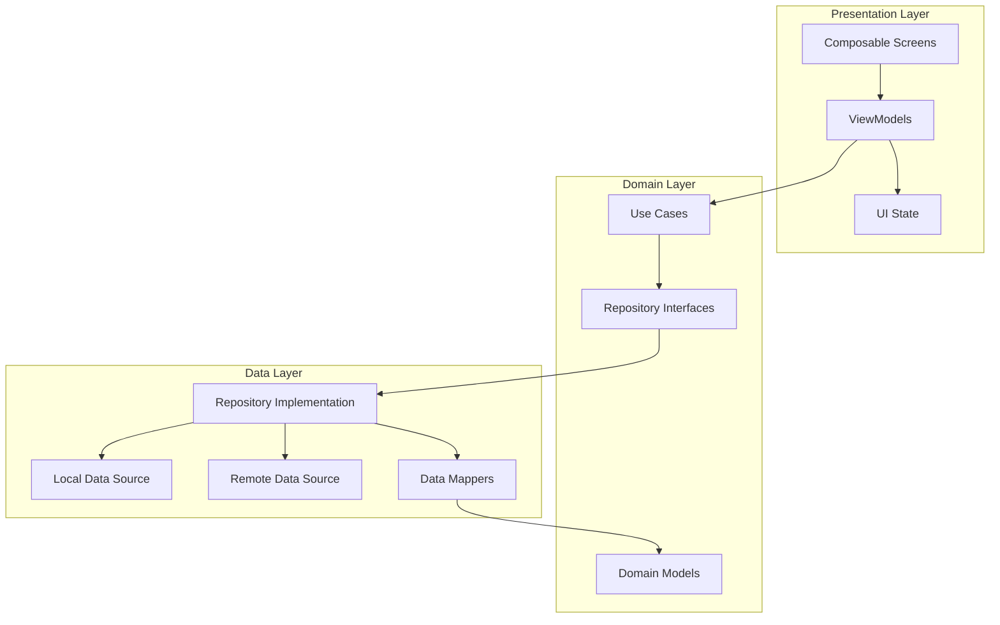

# AI-Thaker Implementation Plan

> **Project:** AI-Thaker (Islamic Athkar & Supplications App)  
> **Platform:** Android (Kotlin + Jetpack Compose)  
> **Architecture:** Clean Architecture + MVVM  
> **Timeline:** 8-12 Weeks  
> **Team Size:** 1-3 Developers

---

## 📑 Table of Contents

1. [Project Overview](#project-overview)
2. [Goals & Objectives](#goals--objectives)
3. [Technical Stack](#technical-stack)
4. [Architecture Summary](#architecture-summary)
5. [Development Phases](#development-phases)
6. [Detailed Implementation Steps](#detailed-implementation-steps)
7. [Quality Assurance](#quality-assurance)
8. [Deployment Strategy](#deployment-strategy)
9. [Maintenance & Updates](#maintenance--updates)
10. [Timeline & Milestones](#timeline--milestones)

---

## Project Overview

### **What is AI-Thaker?**

AI-Thaker is an Android application that helps Muslims access and memorize daily Islamic supplications (Athkar) and prayers. The app provides:

- **Daily Athkar**: Morning and evening supplications
- **Categorized Athkar**: Prayer-specific, meditation, protection, etc.
- **Arabic Text**: Original Arabic text with transliteration
- **Translations**: Multiple language support
- **Audio Playback**: Correct pronunciation guidance
- **Counter**: Track repetitions
- **Reminders**: Daily notifications
- **Favorites**: Bookmark frequently used Athkar
- **Search**: Quick access to specific supplications
- **Offline Access**: Full functionality without internet

### **Target Audience**

- Muslims seeking to strengthen their daily spiritual practice
- New Muslims learning prayers
- Parents teaching children
- Anyone interested in Islamic spirituality

---

## Goals & Objectives

### **Primary Objectives**

1. ✅ **Build a clean, maintainable codebase** following best practices
2. ✅ **Create an intuitive, beautiful UI** using Material Design 3
3. ✅ **Ensure offline-first functionality** with local data storage
4. ✅ **Implement robust testing** (70%+ code coverage)
5. ✅ **Optimize performance** (smooth 60 FPS, fast load times)
6. ✅ **Support accessibility** (TalkBack, large text, high contrast)

### **Secondary Objectives**

- 📱 Support Android 7.0+ (API 24+)
- 🌍 Multi-language support (Arabic, English, expand later)
- 🎨 Modern, premium design aesthetic
- 🔄 Regular content updates
- 📊 Analytics for feature usage (privacy-friendly)

---

## Technical Stack

### **Core Technologies**

| Category                 | Technology                | Version | Purpose                      |
| ------------------------ | ------------------------- | ------- | ---------------------------- |
| **Language**             | Kotlin                    | 1.9+    | Primary development language |
| **UI Framework**         | Jetpack Compose           | Latest  | Modern declarative UI        |
| **Architecture**         | Clean Architecture + MVVM | -       | Code organization            |
| **Dependency Injection** | Hilt (Dagger)             | 2.48+   | DI framework                 |
| **Database**             | Room                      | 2.6+    | Local data persistence       |
| **Async**                | Coroutines + Flow         | 1.7+    | Asynchronous programming     |
| **Navigation**           | Compose Navigation        | Latest  | Screen navigation            |
| **Testing**              | JUnit, Mockk, Turbine     | Latest  | Unit & integration tests     |

### **Supporting Libraries**

```kotlin
// UI & Theming
implementation("androidx.compose.material3:material3:1.1.2")
implementation("androidx.compose.ui:ui-tooling-preview")

// Architecture Components
implementation("androidx.lifecycle:lifecycle-viewmodel-compose:2.6.2")
implementation("androidx.lifecycle:lifecycle-runtime-compose:2.6.2")

// Dependency Injection
implementation("com.google.dagger:hilt-android:2.48")
ksp("com.google.dagger:hilt-compiler:2.48")
implementation("androidx.hilt:hilt-navigation-compose:1.1.0")

// Database
implementation("androidx.room:room-runtime:2.6.0")
implementation("androidx.room:room-ktx:2.6.0")
ksp("androidx.room:room-compiler:2.6.0")

// Data Storage
implementation("androidx.datastore:datastore-preferences:1.0.0")

// Media Player (for audio)
implementation("androidx.media3:media3-exoplayer:1.2.0")

// Image Loading
implementation("io.coil-kt:coil-compose:2.5.0")

// Testing
testImplementation("junit:junit:4.13.2")
testImplementation("io.mockk:mockk:1.13.8")
testImplementation("app.cash.turbine:turbine:1.0.0")
testImplementation("org.jetbrains.kotlinx:kotlinx-coroutines-test:1.7.3")
androidTestImplementation("androidx.compose.ui:ui-test-junit4")
```

---

## Architecture Summary

### **Three-Layer Clean Architecture**



### **Key Principles**

1. **Separation of Concerns**: Each layer has a single responsibility
2. **Dependency Inversion**: Outer layers depend on inner layers
3. **Testability**: Pure domain logic, easy to test
4. **Scalability**: Easy to add new features
5. **Maintainability**: Clear structure, easy to navigate

---

## Development Phases

### **Phase Overview**

| Phase       | Duration  | Focus             | Deliverables                                   |
| ----------- | --------- | ----------------- | ---------------------------------------------- |
| **Phase 0** | Week 1    | Foundation        | Project setup, dependencies, initial structure |
| **Phase 1** | Week 2-3  | Core Data Layer   | Database, models, repositories                 |
| **Phase 2** | Week 3-4  | Domain Logic      | Use cases, business logic                      |
| **Phase 3** | Week 4-6  | UI Development    | Screens, navigation, components                |
| **Phase 4** | Week 6-7  | Features & Polish | Audio, reminders, search, favorites            |
| **Phase 5** | Week 7-8  | Testing & QA      | Unit tests, integration tests, bug fixes       |
| **Phase 6** | Week 8-9  | Optimization      | Performance tuning, accessibility              |
| **Phase 7** | Week 9-10 | Deployment        | Release preparation, Play Store                |
| **Phase 8** | Ongoing   | Maintenance       | Updates, bug fixes, new features               |

---

## Detailed Implementation Steps

## Phase 0: Foundation Setup (Week 1)

### **Objectives**

- Set up development environment
- Create project structure
- Configure build system
- Initialize version control

### **Tasks**

#### **0.1 Project Initialization**

**Create New Android Project:**

```bash
# Already created with:
# - Compose Activity template
# - Kotlin language
# - Minimum SDK 24 (Android 7.0)
# - Package: com.example.aithaker
```

**Configure Version Control:**

- [ ] Initialize Git repository
- [ ] Create `.gitignore` file
- [ ] Create feature branch structure
- [ ] Set up commit message conventions
- [ ] Create initial commit

```bash
git init
git add .
git commit -m "Initial commit: Project setup with Compose"
git branch develop
git checkout develop
```

#### **0.2 Update Gradle Configuration**

**Root `build.gradle.kts`:**

```kotlin
plugins {
    alias(libs.plugins.android.application) apply false
    alias(libs.plugins.kotlin.android) apply false
    alias(libs.plugins.kotlin.compose) apply false
    id("com.google.dagger.hilt.android") version "2.48" apply false
    id("com.google.devtools.ksp") version "1.9.20-1.0.14" apply false
}
```

**App `build.gradle.kts`:**

```kotlin
plugins {
    alias(libs.plugins.android.application)
    alias(libs.plugins.kotlin.android)
    alias(libs.plugins.kotlin.compose)
    id("com.google.dagger.hilt.android")
    id("com.google.devtools.ksp")
}

android {
    namespace = "com.example.aithaker"
    compileSdk = 34

    defaultConfig {
        applicationId = "com.example.aithaker"
        minSdk = 24
        targetSdk = 34
        versionCode = 1
        versionName = "1.0.0"

        testInstrumentationRunner = "androidx.test.runner.AndroidJUnitRunner"
        vectorDrawables {
            useSupportLibrary = true
        }
    }

    buildTypes {
        release {
            isMinifyEnabled = true
            proguardFiles(
                getDefaultProguardFile("proguard-android-optimize.txt"),
                "proguard-rules.pro"
            )
        }
        debug {
            applicationIdSuffix = ".debug"
            versionNameSuffix = "-debug"
        }
    }

    compileOptions {
        sourceCompatibility = JavaVersion.VERSION_17
        targetCompatibility = JavaVersion.VERSION_17
    }

    kotlinOptions {
        jvmTarget = "17"
    }

    buildFeatures {
        compose = true
    }

    packaging {
        resources {
            excludes += "/META-INF/{AL2.0,LGPL2.1}"
        }
    }
}

dependencies {
    // Compose BOM
    implementation(platform("androidx.compose:compose-bom:2023.10.01"))
    implementation("androidx.compose.ui:ui")
    implementation("androidx.compose.ui:ui-graphics")
    implementation("androidx.compose.ui:ui-tooling-preview")
    implementation("androidx.compose.material3:material3")

    // Core Android
    implementation("androidx.core:core-ktx:1.12.0")
    implementation("androidx.lifecycle:lifecycle-runtime-ktx:2.6.2")
    implementation("androidx.activity:activity-compose:1.8.1")

    // ViewModel
    implementation("androidx.lifecycle:lifecycle-viewmodel-compose:2.6.2")
    implementation("androidx.lifecycle:lifecycle-runtime-compose:2.6.2")

    // Navigation
    implementation("androidx.navigation:navigation-compose:2.7.5")

    // Hilt
    implementation("com.google.dagger:hilt-android:2.48")
    ksp("com.google.dagger:hilt-compiler:2.48")
    implementation("androidx.hilt:hilt-navigation-compose:1.1.0")

    // Room
    implementation("androidx.room:room-runtime:2.6.0")
    implementation("androidx.room:room-ktx:2.6.0")
    ksp("androidx.room:room-compiler:2.6.0")

    // DataStore
    implementation("androidx.datastore:datastore-preferences:1.0.0")

    // Testing
    testImplementation("junit:junit:4.13.2")
    testImplementation("io.mockk:mockk:1.13.8")
    testImplementation("app.cash.turbine:turbine:1.0.0")
    testImplementation("org.jetbrains.kotlinx:kotlinx-coroutines-test:1.7.3")

    androidTestImplementation(platform("androidx.compose:compose-bom:2023.10.01"))
    androidTestImplementation("androidx.compose.ui:ui-test-junit4")
    androidTestImplementation("androidx.test.ext:junit:1.1.5")
    androidTestImplementation("androidx.test.espresso:espresso-core:3.5.1")

    debugImplementation("androidx.compose.ui:ui-tooling")
    debugImplementation("androidx.compose.ui:ui-test-manifest")
}
```

#### **0.3 Create Package Structure**

```bash
app/src/main/java/com/example/aithaker/
├── ui/
│   ├── screens/
│   │   ├── home/
│   │   ├── athkar/
│   │   ├── categories/
│   │   ├── favorites/
│   │   └── settings/
│   ├── components/
│   ├── navigation/
│   └── theme/
├── domain/
│   ├── model/
│   ├── repository/
│   └── usecase/
├── data/
│   ├── repository/
│   ├── local/
│   │   ├── database/
│   │   ├── dao/
│   │   ├── entity/
│   │   └── datastore/
│   ├── remote/  # For future API integration
│   └── mapper/
├── di/
├── common/
│   ├── utils/
│   ├── constants/
│   └── extensions/
└── MainActivity.kt
```

#### **0.4 Create Application Class**

**File:** `AiThakerApplication.kt`

```kotlin
package com.example.aithaker

import android.app.Application
import dagger.hilt.android.HiltAndroidApp

@HiltAndroidApp
class AiThakerApplication : Application() {
    override fun onCreate() {
        super.onCreate()
        // Initialize any global configurations here
    }
}
```

**Update `AndroidManifest.xml`:**

```xml
<application
    android:name=".AiThakerApplication"
    android:allowBackup="true"
    ...>
```

#### **0.5 Create Core Common Classes**

**File:** `common/AppError.kt`

```kotlin
package com.example.aithaker.common

sealed class AppError {
    data class DatabaseError(val message: String) : AppError()
    data class ValidationError(val field: String, val message: String) : AppError()
    data object NotFound : AppError()
    data class Unknown(val exception: Throwable) : AppError()
}

fun Throwable.toAppError(): AppError = when (this) {
    is IllegalArgumentException -> AppError.ValidationError("input", message ?: "Invalid input")
    else -> AppError.Unknown(this)
}

fun AppError.toUserMessage(): String = when (this) {
    is AppError.DatabaseError -> "حدث خطأ في قاعدة البيانات"
    is AppError.ValidationError -> "$field: $message"
    is AppError.NotFound -> "المحتوى غير موجود"
    is AppError.Unknown -> "حدث خطأ غير متوقع"
}
```

**File:** `common/constants/AppConstants.kt`

```kotlin
package com.example.aithaker.common.constants

object AppConstants {
    const val DATABASE_NAME = "aithaker_db"
    const val DATABASE_VERSION = 1

    object PreferenceKeys {
        const val THEME_MODE = "theme_mode"
        const val LANGUAGE = "language"
        const val NOTIFICATION_ENABLED = "notification_enabled"
    }

    object Notifications {
        const val CHANNEL_ID = "athkar_reminders"
        const val MORNING_ATHKAR_ID = 1001
        const val EVENING_ATHKAR_ID = 1002
    }
}
```

#### **0.6 Setup Theme**

**File:** `ui/theme/Color.kt`

```kotlin
package com.example.aithaker.ui.theme

import androidx.compose.ui.graphics.Color

// Light theme colors
val PrimaryLight = Color(0xFF006C51)
val OnPrimaryLight = Color(0xFFFFFFFF)
val SecondaryLight = Color(0xFF4D6357)
val TertiaryLight = Color(0xFF3D6373)
val BackgroundLight = Color(0xFFFBFDF9)
val SurfaceLight = Color(0xFFFBFDF9)

// Dark theme colors
val PrimaryDark = Color(0xFF6FDBBB)
val OnPrimaryDark = Color(0xFF003828)
val SecondaryDark = Color(0xFFB1CCBF)
val TertiaryDark = Color(0xFFA6CEDE)
val BackgroundDark = Color(0xFF191C1A)
val SurfaceDark = Color(0xFF191C1A)
```

**File:** `ui/theme/Theme.kt`

```kotlin
package com.example.aithaker.ui.theme

import android.app.Activity
import androidx.compose.foundation.isSystemInDarkTheme
import androidx.compose.material3.*
import androidx.compose.runtime.Composable
import androidx.compose.runtime.SideEffect
import androidx.compose.ui.graphics.toArgb
import androidx.compose.ui.platform.LocalView
import androidx.core.view.WindowCompat

private val LightColorScheme = lightColorScheme(
    primary = PrimaryLight,
    onPrimary = OnPrimaryLight,
    secondary = SecondaryLight,
    tertiary = TertiaryLight,
    background = BackgroundLight,
    surface = SurfaceLight
)

private val DarkColorScheme = darkColorScheme(
    primary = PrimaryDark,
    onPrimary = OnPrimaryDark,
    secondary = SecondaryDark,
    tertiary = TertiaryDark,
    background = BackgroundDark,
    surface = SurfaceDark
)

@Composable
fun AiThakerTheme(
    darkTheme: Boolean = isSystemInDarkTheme(),
    content: @Composable () -> Unit
) {
    val colorScheme = if (darkTheme) DarkColorScheme else LightColorScheme

    val view = LocalView.current
    if (!view.isInEditMode) {
        SideEffect {
            val window = (view.context as Activity).window
            window.statusBarColor = colorScheme.primary.toArgb()
            WindowCompat.getInsetsController(window, view).isAppearanceLightStatusBars = !darkTheme
        }
    }

    MaterialTheme(
        colorScheme = colorScheme,
        typography = Typography,
        content = content
    )
}
```

**Deliverables:**

- ✅ Project structure created
- ✅ Dependencies configured
- ✅ Hilt initialized
- ✅ Common classes created
- ✅ Theme setup completed
- ✅ Git repository initialized

---

## Phase 1: Core Data Layer (Week 2-3)

### **Objectives**

- Design database schema
- Create Room database
- Implement repositories
- Set up initial data

### **Tasks**

#### **1.1 Define Domain Models**

**File:** `domain/model/AthkarCategory.kt`

```kotlin
package com.example.aithaker.domain.model

enum class AthkarCategory(val displayNameAr: String, val displayNameEn: String) {
    MORNING("أذكار الصباح", "Morning Athkar"),
    EVENING("أذكار المساء", "Evening Athkar"),
    AFTER_PRAYER("أذكار بعد الصلاة", "After Prayer"),
    SLEEPING("أذكار النوم", "Sleeping"),
    WAKING_UP("أذكار الإستيقاظ", "Waking Up"),
    PROTECTION("أذكار الحفظ", "Protection"),
    GENERAL("أذكار عامة", "General Athkar");

    fun getDisplayName(isArabic: Boolean): String {
        return if (isArabic) displayNameAr else displayNameEn
    }
}
```

**File:** `domain/model/Athkar.kt`

```kotlin
package com.example.aithaker.domain.model

data class Athkar(
    val id: String,
    val arabicText: String,
    val transliteration: String? = null,
    val translationEn: String,
    val translationAr: String? = null,
    val category: AthkarCategory,
    val repeatCount: Int = 1,
    val reference: String? = null,
    val audioUrl: String? = null,
    val isFavorite: Boolean = false,
    val orderIndex: Int = 0
)
```

#### **1.2 Create Database Entities**

**File:** `data/local/entity/AthkarEntity.kt`

```kotlin
package com.example.aithaker.data.local.entity

import androidx.room.Entity
import androidx.room.PrimaryKey
import com.example.aithaker.domain.model.AthkarCategory

@Entity(tableName = "athkar")
data class AthkarEntity(
    @PrimaryKey val id: String,
    val arabicText: String,
    val transliteration: String?,
    val translationEn: String,
    val translationAr: String?,
    val category: String,  // Store as String, convert to enum
    val repeatCount: Int,
    val reference: String?,
    val audioUrl: String?,
    val isFavorite: Boolean,
    val orderIndex: Int
)
```

#### **1.3 Create Type Converters**

**File:** `data/local/database/Converters.kt`

```kotlin
package com.example.aithaker.data.local.database

import androidx.room.TypeConverter
import com.example.aithaker.domain.model.AthkarCategory

class Converters {
    @TypeConverter
    fun fromCategory(category: AthkarCategory): String {
        return category.name
    }

    @TypeConverter
    fun toCategory(value: String): AthkarCategory {
        return AthkarCategory.valueOf(value)
    }
}
```

#### **1.4 Create DAOs**

**File:** `data/local/dao/AthkarDao.kt`

```kotlin
package com.example.aithaker.data.local.dao

import androidx.room.*
import com.example.aithaker.data.local.entity.AthkarEntity
import kotlinx.coroutines.flow.Flow

@Dao
interface AthkarDao {

    @Query("SELECT * FROM athkar ORDER BY orderIndex ASC")
    fun getAllAthkar(): Flow<List<AthkarEntity>>

    @Query("SELECT * FROM athkar WHERE category = :category ORDER BY orderIndex ASC")
    fun getAthkarByCategory(category: String): Flow<List<AthkarEntity>>

    @Query("SELECT * FROM athkar WHERE id = :id")
    suspend fun getAthkarById(id: String): AthkarEntity?

    @Query("SELECT * FROM athkar WHERE isFavorite = 1 ORDER BY orderIndex ASC")
    fun getFavoriteAthkar(): Flow<List<AthkarEntity>>

    @Query("SELECT * FROM athkar WHERE arabicText LIKE '%' || :query || '%' OR translationEn LIKE '%' || :query || '%'")
    fun searchAthkar(query: String): Flow<List<AthkarEntity>>

    @Insert(onConflict = OnConflictStrategy.REPLACE)
    suspend fun insertAthkar(athkar: AthkarEntity)

    @Insert(onConflict = OnConflictStrategy.REPLACE)
    suspend fun insertAllAthkar(athkarList: List<AthkarEntity>)

    @Update
    suspend fun updateAthkar(athkar: AthkarEntity)

    @Query("UPDATE athkar SET isFavorite = :isFavorite WHERE id = :id")
    suspend fun updateFavoriteStatus(id: String, isFavorite: Boolean)

    @Delete
    suspend fun deleteAthkar(athkar: AthkarEntity)

    @Query("DELETE FROM athkar")
    suspend fun deleteAllAthkar()
}
```

#### **1.5 Create Room Database**

**File:** `data/local/database/AthkarDatabase.kt`

```kotlin
package com.example.aithaker.data.local.database

import androidx.room.Database
import androidx.room.RoomDatabase
import androidx.room.TypeConverters
import com.example.aithaker.data.local.dao.AthkarDao
import com.example.aithaker.data.local.entity.AthkarEntity

@Database(
    entities = [AthkarEntity::class],
    version = 1,
    exportSchema = false
)
@TypeConverters(Converters::class)
abstract class AthkarDatabase : RoomDatabase() {
    abstract fun athkarDao(): AthkarDao
}
```

#### **1.6 Create Mappers**

**File:** `data/mapper/AthkarMapper.kt`

```kotlin
package com.example.aithaker.data.mapper

import com.example.aithaker.data.local.entity.AthkarEntity
import com.example.aithaker.domain.model.Athkar
import com.example.aithaker.domain.model.AthkarCategory

fun AthkarEntity.toDomain(): Athkar {
    return Athkar(
        id = id,
        arabicText = arabicText,
        transliteration = transliteration,
        translationEn = translationEn,
        translationAr = translationAr,
        category = AthkarCategory.valueOf(category),
        repeatCount = repeatCount,
        reference = reference,
        audioUrl = audioUrl,
        isFavorite = isFavorite,
        orderIndex = orderIndex
    )
}

fun Athkar.toEntity(): AthkarEntity {
    return AthkarEntity(
        id = id,
        arabicText = arabicText,
        transliteration = transliteration,
        translationEn = translationEn,
        translationAr = translationAr,
        category = category.name,
        repeatCount = repeatCount,
        reference = reference,
        audioUrl = audioUrl,
        isFavorite = isFavorite,
        orderIndex = orderIndex
    )
}
```

_(Continued in next part due to length...)_

**Note:** This implementation plan continues with:

- Phase 2: Domain Logic
- Phase 3: UI Development
- Phase 4: Features & Polish
- Phase 5-8: Testing, Optimization, Deployment, Maintenance

Would you like me to complete the remaining phases?

---

## Quick Start Checklist

### **Week 1: Foundation**

- [ ] Complete Phase 0 tasks
- [ ] Set up development environment
- [ ] Create project structure
- [ ] Initialize Git repository

### **Week 2-3: Data Layer**

- [ ] Complete Phase 1 tasks
- [ ] Create database schema
- [ ] Implement repositories
- [ ] Populate initial data

### **Week 4-6: Features**

- [ ] Build core UI screens
- [ ] Implement navigation
- [ ] Add business logic
- [ ] Create reusable components

### **Week 7-8: Testing & Polish**

- [ ] Write unit tests
- [ ] Write integration tests
- [ ] Fix bugs
- [ ] Optimize performance

### **Week 9-10: Deployment**

- [ ] Prepare release build
- [ ] Create Play Store assets
- [ ] Submit to Play Store
- [ ] Monitor analytics

---

**Document Status:** PART 1 OF 2  
**Next:** Phases 2-8 detailed implementation  
**Version:** 1.0  
**Last Updated:** 2025-11-22
