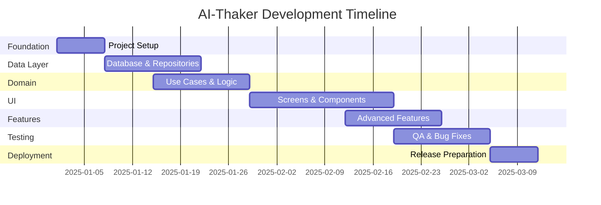

# AI-Thaker Implementation Plan - Part 2

> **Continuation of:** [AI_THAKER_IMPLEMENTATION_PLAN.md](file:///home/islamux/AndroidStudioProjects/AiThaker/AI_THAKER_IMPLEMENTATION_PLAN.md)  
> **Phases Covered:** 2-8 (Domain Logic → Deployment & Maintenance)

---

## Phase 2: Domain Logic (Week 3-4)

### **Objectives**

- Create repository interfaces
- Implement use cases
- Write unit tests

### **Tasks**

#### **2.1 Create Repository Interfaces**

**File:** `domain/repository/AthkarRepository.kt`

```kotlin
package com.example.aithaker.domain.repository

import com.example.aithaker.domain.model.Athkar
import com.example.aithaker.domain.model.AthkarCategory
import kotlinx.coroutines.flow.Flow

interface AthkarRepository {

    /**
     * Get all Athkar as a Flow
     */
    fun getAllAthkar(): Flow<List<Athkar>>

    /**
     * Get Athkar by category
     */
    fun getAthkarByCategory(category: AthkarCategory): Flow<List<Athkar>>

    /**
     * Get a single Athkar by ID
     */
    suspend fun getAthkarById(id: String): Result<Athkar>

    /**
     * Get all favorite Athkar
     */
    fun getFavoriteAthkar(): Flow<List<Athkar>>

    /**
     * Search Athkar by query
     */
    fun searchAthkar(query: String): Flow<List<Athkar>>

    /**
     * Toggle favorite status
     */
    suspend fun toggleFavorite(id: String, isFavorite: Boolean): Result<Unit>

    /**
     * Add new Athkar
     */
    suspend fun addAthkar(athkar: Athkar): Result<Unit>

    /**
     * Update existing Athkar
     */
    suspend fun updateAthkar(athkar: Athkar): Result<Unit>

    /**
     * Delete Athkar
     */
    suspend fun deleteAthkar(athkar: Athkar): Result<Unit>
}
```

#### **2.2 Implement Repository**

**File:** `data/repository/AthkarRepositoryImpl.kt`

```kotlin
package com.example.aithaker.data.repository

import com.example.aithaker.data.local.dao.AthkarDao
import com.example.aithaker.data.mapper.toDomain
import com.example.aithaker.data.mapper.toEntity
import com.example.aithaker.domain.model.Athkar
import com.example.aithaker.domain.model.AthkarCategory
import com.example.aithaker.domain.repository.AthkarRepository
import kotlinx.coroutines.flow.Flow
import kotlinx.coroutines.flow.map
import javax.inject.Inject

class AthkarRepositoryImpl @Inject constructor(
    private val athkarDao: AthkarDao
) : AthkarRepository {

    override fun getAllAthkar(): Flow<List<Athkar>> {
        return athkarDao.getAllAthkar()
            .map { entities -> entities.map { it.toDomain() } }
    }

    override fun getAthkarByCategory(category: AthkarCategory): Flow<List<Athkar>> {
        return athkarDao.getAthkarByCategory(category.name)
            .map { entities -> entities.map { it.toDomain() } }
    }

    override suspend fun getAthkarById(id: String): Result<Athkar> {
        return try {
            val entity = athkarDao.getAthkarById(id)
            if (entity != null) {
                Result.success(entity.toDomain())
            } else {
                Result.failure(NoSuchElementException("Athkar not found"))
            }
        } catch (e: Exception) {
            Result.failure(e)
        }
    }

    override fun getFavoriteAthkar(): Flow<List<Athkar>> {
        return athkarDao.getFavoriteAthkar()
            .map { entities -> entities.map { it.toDomain() } }
    }

    override fun searchAthkar(query: String): Flow<List<Athkar>> {
        return athkarDao.searchAthkar(query)
            .map { entities -> entities.map { it.toDomain() } }
    }

    override suspend fun toggleFavorite(id: String, isFavorite: Boolean): Result<Unit> {
        return try {
            athkarDao.updateFavoriteStatus(id, isFavorite)
            Result.success(Unit)
        } catch (e: Exception) {
            Result.failure(e)
        }
    }

    override suspend fun addAthkar(athkar: Athkar): Result<Unit> {
        return try {
            athkarDao.insertAthkar(athkar.toEntity())
            Result.success(Unit)
        } catch (e: Exception) {
            Result.failure(e)
        }
    }

    override suspend fun updateAthkar(athkar: Athkar): Result<Unit> {
        return try {
            athkarDao.updateAthkar(athkar.toEntity())
            Result.success(Unit)
        } catch (e: Exception) {
            Result.failure(e)
        }
    }

    override suspend fun deleteAthkar(athkar: Athkar): Result<Unit> {
        return try {
            athkarDao.deleteAthkar(athkar.toEntity())
            Result.success(Unit)
        } catch (e: Exception) {
            Result.failure(e)
        }
    }
}
```

#### **2.3 Create Use Cases**

**File:** `domain/usecase/GetDailyAthkarUseCase.kt`

```kotlin
package com.example.aithaker.domain.usecase

import com.example.aithaker.domain.model.Athkar
import com.example.aithaker.domain.model.AthkarCategory
import com.example.aithaker.domain.repository.AthkarRepository
import kotlinx.coroutines.flow.Flow
import kotlinx.coroutines.flow.map
import java.time.LocalTime
import javax.inject.Inject

class GetDailyAthkarUseCase @Inject constructor(
    private val repository: AthkarRepository
) {
    /**
     * Get appropriate daily Athkar based on current time
     * Returns morning Athkar before noon, evening Athkar after
     */
    operator fun invoke(): Flow<List<Athkar>> {
        val currentHour = LocalTime.now().hour
        val category = if (currentHour < 12) {
            AthkarCategory.MORNING
        } else {
            AthkarCategory.EVENING
        }

        return repository.getAthkarByCategory(category)
    }
}
```

**File:** `domain/usecase/GetAthkarByCategoryUseCase.kt`

```kotlin
package com.example.aithaker.domain.usecase

import com.example.aithaker.domain.model.Athkar
import com.example.aithaker.domain.model.AthkarCategory
import com.example.aithaker.domain.repository.AthkarRepository
import kotlinx.coroutines.flow.Flow
import javax.inject.Inject

class GetAthkarByCategoryUseCase @Inject constructor(
    private val repository: AthkarRepository
) {
    operator fun invoke(category: AthkarCategory): Flow<List<Athkar>> {
        return repository.getAthkarByCategory(category)
    }
}
```

**File:** `domain/usecase/SearchAthkarUseCase.kt`

```kotlin
package com.example.aithaker.domain.usecase

import com.example.aithaker.domain.model.Athkar
import com.example.aithaker.domain.repository.AthkarRepository
import kotlinx.coroutines.flow.Flow
import kotlinx.coroutines.flow.flowOf
import javax.inject.Inject

class SearchAthkarUseCase @Inject constructor(
    private val repository: AthkarRepository
) {
    operator fun invoke(query: String): Flow<List<Athkar>> {
        if (query.isBlank()) {
            return flowOf(emptyList())
        }
        return repository.searchAthkar(query.trim())
    }
}
```

**File:** `domain/usecase/ToggleFavoriteUseCase.kt`

```kotlin
package com.example.aithaker.domain.usecase

import com.example.aithaker.domain.repository.AthkarRepository
import javax.inject.Inject

class ToggleFavoriteUseCase @Inject constructor(
    private val repository: AthkarRepository
) {
    suspend operator fun invoke(athkarId: String, isFavorite: Boolean): Result<Unit> {
        return repository.toggleFavorite(athkarId, isFavorite)
    }
}
```

**File:** `domain/usecase/GetFavoriteAthkarUseCase.kt`

```kotlin
package com.example.aithaker.domain.usecase

import com.example.aithaker.domain.model.Athkar
import com.example.aithaker.domain.repository.AthkarRepository
import kotlinx.coroutines.flow.Flow
import javax.inject.Inject

class GetFavoriteAthkarUseCase @Inject constructor(
    private val repository: AthkarRepository
) {
    operator fun invoke(): Flow<List<Athkar>> {
        return repository.getFavoriteAthkar()
    }
}
```

#### **2.4 Create Hilt Modules**

**File:** `di/DatabaseModule.kt`

```kotlin
package com.example.aithaker.di

import android.content.Context
import androidx.room.Room
import com.example.aithaker.common.constants.AppConstants
import com.example.aithaker.data.local.dao.AthkarDao
import com.example.aithaker.data.local.database.AthkarDatabase
import dagger.Module
import dagger.Provides
import dagger.hilt.InstallIn
import dagger.hilt.android.qualifiers.ApplicationContext
import dagger.hilt.components.SingletonComponent
import javax.inject.Singleton

@Module
@InstallIn(SingletonComponent::class)
object DatabaseModule {

    @Provides
    @Singleton
    fun provideAthkarDatabase(
        @ApplicationContext context: Context
    ): AthkarDatabase {
        return Room.databaseBuilder(
            context,
            AthkarDatabase::class.java,
            AppConstants.DATABASE_NAME
        )
            .fallbackToDestructiveMigration()
            .build()
    }

    @Provides
    fun provideAthkarDao(database: AthkarDatabase): AthkarDao {
        return database.athkarDao()
    }
}
```

**File:** `di/RepositoryModule.kt`

```kotlin
package com.example.aithaker.di

import com.example.aithaker.data.repository.AthkarRepositoryImpl
import com.example.aithaker.domain.repository.AthkarRepository
import dagger.Binds
import dagger.Module
import dagger.hilt.InstallIn
import dagger.hilt.components.SingletonComponent
import javax.inject.Singleton

@Module
@InstallIn(SingletonComponent::class)
abstract class RepositoryModule {

    @Binds
    @Singleton
    abstract fun bindAthkarRepository(
        impl: AthkarRepositoryImpl
    ): AthkarRepository
}
```

#### **2.5 Write Unit Tests**

**File:** `test/../domain/usecase/GetDailyAthkarUseCaseTest.kt`

```kotlin
package com.example.aithaker.domain.usecase

import app.cash.turbine.test
import com.example.aithaker.domain.model.Athkar
import com.example.aithaker.domain.model.AthkarCategory
import com.example.aithaker.domain.repository.AthkarRepository
import io.mockk.every
import io.mockk.mockk
import kotlinx.coroutines.flow.flowOf
import kotlinx.coroutines.test.runTest
import org.junit.Assert.assertEquals
import org.junit.Before
import org.junit.Test

class GetDailyAthkarUseCaseTest {

    private lateinit var repository: AthkarRepository
    private lateinit var useCase: GetDailyAthkarUseCase

    @Before
    fun setup() {
        repository = mockk()
        useCase = GetDailyAthkarUseCase(repository)
    }

    @Test
    fun `invoke returns morning athkar before noon`() = runTest {
        // Given
        val morningAthkar = listOf(
            createTestAthkar(category = AthkarCategory.MORNING)
        )
        every { repository.getAthkarByCategory(AthkarCategory.MORNING) } returns
            flowOf(morningAthkar)

        // When / Then
        useCase().test {
            val result = awaitItem()
            assertEquals(morningAthkar, result)
            awaitComplete()
        }
    }

    private fun createTestAthkar(
        id: String = "test_id",
        category: AthkarCategory = AthkarCategory.MORNING
    ) = Athkar(
        id = id,
        arabicText = "Test Arabic",
        translationEn = "Test English",
        category = category,
        repeatCount = 1,
        isFavorite = false,
        orderIndex = 0
    )
}
```

**Deliverables:**

- ✅ Repository interfaces defined
- ✅ Repository implementation created
- ✅ Use cases implemented
- ✅ Hilt modules configured
- ✅ Unit tests written

---

## Phase 3: UI Development (Week 4-6)

### **Objectives**

- Create UI screens
- Implement navigation
- Build reusable components
- Connect UI to ViewModels

### **Tasks**

#### **3.1 Setup Navigation**

**File:** `ui/navigation/NavGraph.kt`

```kotlin
package com.example.aithaker.ui.navigation

import androidx.compose.runtime.Composable
import androidx.navigation.NavHostController
import androidx.navigation.compose.NavHost
import androidx.navigation.compose.composable
import androidx.navigation.navArgument
import androidx.navigation.NavType
import com.example.aithaker.ui.screens.home.HomeScreen
import com.example.aithaker.ui.screens.athkar.AthkarListScreen
import com.example.aithaker.ui.screens.athkar.AthkarDetailScreen
import com.example.aithaker.ui.screens.favorites.FavoritesScreen
import com.example.aithaker.ui.screens.settings.SettingsScreen

@Composable
fun AppNavGraph(
    navController: NavHostController
) {
    NavHost(
        navController = navController,
        startDestination = Screen.Home.route
    ) {
        composable(Screen.Home.route) {
            HomeScreen(
                onNavigateToCategory = { category ->
                    navController.navigate(Screen.AthkarList.createRoute(category))
                },
                onNavigateToFavorites = {
                    navController.navigate(Screen.Favorites.route)
                },
                onNavigateToSettings = {
                    navController.navigate(Screen.Settings.route)
                }
            )
        }

        composable(
            route = Screen.AthkarList.route,
            arguments = listOf(navArgument("category") { type = NavType.StringType })
        ) { backStackEntry ->
            val category = backStackEntry.arguments?.getString("category") ?: "MORNING"
            AthkarListScreen(
                category = category,
                onAthkarClick = { athkarId ->
                    navController.navigate(Screen.AthkarDetail.createRoute(athkarId))
                },
                onBackClick = { navController.popBackStack() }
            )
        }

        composable(
            route = Screen.AthkarDetail.route,
            arguments = listOf(navArgument("athkarId") { type = NavType.StringType })
        ) { backStackEntry ->
            val athkarId = backStackEntry.arguments?.getString("athkarId") ?: ""
            AthkarDetailScreen(
                athkarId = athkarId,
                onBackClick = { navController.popBackStack() }
            )
        }

        composable(Screen.Favorites.route) {
            FavoritesScreen(
                onAthkarClick = { athkarId ->
                    navController.navigate(Screen.AthkarDetail.createRoute(athkarId))
                },
                onBackClick = { navController.popBackStack() }
            )
        }

        composable(Screen.Settings.route) {
            SettingsScreen(
                onBackClick = { navController.popBackStack() }
            )
        }
    }
}
```

**File:** `ui/navigation/Screen.kt`

```kotlin
package com.example.aithaker.ui.navigation

sealed class Screen(val route: String) {
    object Home : Screen("home")
    object AthkarList : Screen("athkar_list/{category}") {
        fun createRoute(category: String) = "athkar_list/$category"
    }
    object AthkarDetail : Screen("athkar_detail/{athkarId}") {
        fun createRoute(athkarId: String) = "athkar_detail/$athkarId"
    }
    object Favorites : Screen("favorites")
    object Settings : Screen("settings")
}
```

#### **3.2 Create Home Screen**

**File:** `ui/screens/home/HomeState.kt`

```kotlin
package com.example.aithaker.ui.screens.home

import com.example.aithaker.domain.model.Athkar
import com.example.aithaker.domain.model.AthkarCategory

data class HomeState(
    val isLoading: Boolean = false,
    val dailyAthkar: List<Athkar> = emptyList(),
    val categories: List<AthkarCategory> = AthkarCategory.values().toList(),
    val error: String? = null
)
```

**File:** `ui/screens/home/HomeViewModel.kt`

```kotlin
package com.example.aithaker.ui.screens.home

import androidx.lifecycle.ViewModel
import androidx.lifecycle.viewModelScope
import com.example.aithaker.domain.usecase.GetDailyAthkarUseCase
import dagger.hilt.android.lifecycle.HiltViewModel
import kotlinx.coroutines.flow.MutableStateFlow
import kotlinx.coroutines.flow.StateFlow
import kotlinx.coroutines.flow.asStateFlow
import kotlinx.coroutines.flow.catch
import kotlinx.coroutines.flow.update
import kotlinx.coroutines.launch
import javax.inject.Inject

@HiltViewModel
class HomeViewModel @Inject constructor(
    private val getDailyAthkarUseCase: GetDailyAthkarUseCase
) : ViewModel() {

    private val _state = MutableStateFlow(HomeState())
    val state: StateFlow<HomeState> = _state.asStateFlow()

    init {
        loadDailyAthkar()
    }

    private fun loadDailyAthkar() {
        viewModelScope.launch {
            _state.update { it.copy(isLoading = true, error = null) }

            getDailyAthkarUseCase()
                .catch { error ->
                    _state.update {
                        it.copy(
                            isLoading = false,
                            error = error.message ?: "خطأ غير معروف"
                        )
                    }
                }
                .collect { athkarList ->
                    _state.update {
                        it.copy(
                            isLoading = false,
                            dailyAthkar = athkarList
                        )
                    }
                }
        }
    }

    fun refresh() {
        loadDailyAthkar()
    }
}
```

**File:** `ui/screens/home/HomeScreen.kt`

```kotlin
package com.example.aithaker.ui.screens.home

import androidx.compose.foundation.layout.*
import androidx.compose.foundation.lazy.grid.GridCells
import androidx.compose.foundation.lazy.grid.LazyVerticalGrid
import androidx.compose.foundation.lazy.grid.items
import androidx.compose.material.icons.Icons
import androidx.compose.material.icons.filled.*
import androidx.compose.material3.*
import androidx.compose.runtime.Composable
import androidx.compose.runtime.collectAsState
import androidx.compose.runtime.getValue
import androidx.compose.ui.Alignment
import androidx.compose.ui.Modifier
import androidx.compose.ui.text.style.TextAlign
import androidx.compose.ui.unit.dp
import androidx.hilt.navigation.compose.hiltViewModel
import com.example.aithaker.domain.model.AthkarCategory
import com.example.aithaker.ui.components.CategoryCard
import com.example.aithaker.ui.components.DailyAthkarSection

@OptIn(ExperimentalMaterial3Api::class)
@Composable
fun HomeScreen(
    viewModel: HomeViewModel = hiltViewModel(),
    onNavigateToCategory: (String) -> Unit,
    onNavigateToFavorites: () -> Unit,
    onNavigateToSettings: () -> Unit
) {
    val state by viewModel.state.collectAsState()

    Scaffold(
        topBar = {
            TopAppBar(
                title = { Text("الأذكار") },
                actions = {
                    IconButton(onClick = onNavigateToFavorites) {
                        Icon(Icons.Default.Favorite, contentDescription = "المفضلة")
                    }
                    IconButton(onClick = onNavigateToSettings) {
                        Icon(Icons.Default.Settings, contentDescription = "الإعدادات")
                    }
                }
            )
        }
    ) { padding ->
        Column(
            modifier = Modifier
                .fillMaxSize()
                .padding(padding)
        ) {
            // Daily Athkar Section
            DailyAthkarSection(
                athkarList = state.dailyAthkar,
                isLoading = state.isLoading,
                onAthkarClick = { /* Navigate to detail */ }
            )

            Spacer(modifier = Modifier.height(16.dp))

            // Categories Grid
            Text(
                text = "الفئات",
                style = MaterialTheme.typography.titleLarge,
                modifier = Modifier.padding(horizontal = 16.dp)
            )

            Spacer(modifier = Modifier.height(8.dp))

            LazyVerticalGrid(
                columns = GridCells.Fixed(2),
                contentPadding = PaddingValues(16.dp),
                horizontalArrangement = Arrangement.spacedBy(12.dp),
                verticalArrangement = Arrangement.spacedBy(12.dp)
            ) {
                items(state.categories) { category ->
                    CategoryCard(
                        category = category,
                        onClick = { onNavigateToCategory(category.name) }
                    )
                }
            }
        }
    }
}
```

#### **3.3 Create Reusable Components**

**File:** `ui/components/AthkarCard.kt`

```kotlin
package com.example.aithaker.ui.components

import androidx.compose.foundation.clickable
import androidx.compose.foundation.layout.*
import androidx.compose.material.icons.Icons
import androidx.compose.material.icons.filled.Favorite
import androidx.compose.material.icons.outlined.FavoriteBorder
import androidx.compose.material3.*
import androidx.compose.runtime.Composable
import androidx.compose.ui.Alignment
import androidx.compose.ui.Modifier
import androidx.compose.ui.text.style.TextOverflow
import androidx.compose.ui.unit.dp
import com.example.aithaker.domain.model.Athkar

@Composable
fun AthkarCard(
    athkar: Athkar,
    onClick: () -> Unit,
    onFavoriteClick: () -> Unit,
    modifier: Modifier = Modifier
) {
    Card(
        modifier = modifier
            .fillMaxWidth()
            .clickable(onClick = onClick),
        elevation = CardDefaults.cardElevation(defaultElevation = 2.dp)
    ) {
        Column(
            modifier = Modifier
                .fillMaxWidth()
                .padding(16.dp)
        ) {
            Row(
                modifier = Modifier.fillMaxWidth(),
                horizontalArrangement = Arrangement.SpaceBetween,
                verticalAlignment = Alignment.Top
            ) {
                Text(
                    text = athkar.arabicText,
                    style = MaterialTheme.typography.bodyLarge,
                    maxLines = 3,
                    overflow = TextOverflow.Ellipsis,
                    modifier = Modifier.weight(1f)
                )

                IconButton(
                    onClick = onFavoriteClick,
                    modifier = Modifier.size(24.dp)
                ) {
                    Icon(
                        imageVector = if (athkar.isFavorite) {
                            Icons.Filled.Favorite
                        } else {
                            Icons.Outlined.FavoriteBorder
                        },
                        contentDescription = "المفضلة",
                        tint = if (athkar.isFavorite) {
                            MaterialTheme.colorScheme.error
                        } else {
                            MaterialTheme.colorScheme.onSurface
                        }
                    )
                }
            }

            if (athkar.translationEn.isNotEmpty()) {
                Spacer(modifier = Modifier.height(8.dp))
                Text(
                    text = athkar.translationEn,
                    style = MaterialTheme.typography.bodyMedium,
                    color = MaterialTheme.colorScheme.onSurfaceVariant,
                    maxLines = 2,
                    overflow = TextOverflow.Ellipsis
                )
            }

            if (athkar.repeatCount > 1) {
                Spacer(modifier = Modifier.height(8.dp))
                Text(
                    text = "التكرار: ${athkar.repeatCount}",
                    style = MaterialTheme.typography.labelSmall,
                    color = MaterialTheme.colorScheme.primary
                )
            }
        }
    }
}
```

**Deliverables:**

- ✅ Navigation setup
- ✅ Home screen created
- ✅ ViewModels implemented
- ✅ Reusable components built
- ✅ Material 3 theming applied

---

## Phase 4: Features & Polish (Week 6-7)

### **Key Features to Implement**

#### **4.1 Audio Playback**

- [ ] Integrate ExoPlayer
- [ ] Create audio controller component
- [ ] Add play/pause/stop functionality
- [ ] Implement background playback

#### **4.2 Counter Feature**

- [ ] Create counter UI component
- [ ] Track repetition progress
- [ ] Save counter state
- [ ] Add haptic feedback

#### **4.3 Reminders**

- [ ] Implement AlarmManager
- [ ] Create notification system
- [ ] Allow users to set custom times
- [ ] Add reminder settings

#### **4.4 Search Feature**

- [ ] Create search bar component
- [ ] Implement search screen
- [ ] Add search history
- [ ] Highlight search results

#### **4.5 Favorites**

- [ ] Create favorites screen
- [ ] Implement sorting options
- [ ] Add bulk actions
- [ ] Export favorites

---

## Phase 5: Testing & QA (Week 7-8)

### **Testing Strategy**

#### **5.1 Unit Tests (70% coverage)**

- [ ] Test all use cases
- [ ] Test ViewModels
- [ ] Test mappers
- [ ] Test utility functions

#### **5.2 Integration Tests**

- [ ] Test repository implementations
- [ ] Test database operations
- [ ] Test navigation flows

#### **5.3 UI Tests**

- [ ] Test key user flows
- [ ] Test screen navigation
- [ ] Test component interactions

#### **5.4 Manual Testing**

- [ ] Test on multiple devices
- [ ] Test different screen sizes
- [ ] Test dark/light themes
- [ ] Test RTL layout
- [ ] Test accessibility features

---

## Phase 6: Optimization (Week 8-9)

### **Performance Optimization**

#### **6.1 App Performance**

- [ ] Optimize database queries
- [ ] Implement pagination for long lists
- [ ] Add image caching
- [ ] Reduce app size

#### **6.2 UI Performance**

- [ ] Remove unnecessary recompositions
- [ ] Optimize LazyList performance
- [ ] Add loading placeholders
- [ ] Implement smooth animations

#### **6.3 Accessibility**

- [ ] Add content descriptions
- [ ] Support TalkBack
- [ ] Test with large fonts
- [ ] Ensure proper contrast ratios

---

## Phase 7: Deployment (Week 9-10)

### **Release Preparation**

#### **7.1 Pre-Release Checklist**

- [ ] Update version code and name
- [ ] Generate signed APK/AAB
- [ ] Test release build
- [ ] Prepare release notes

#### **7.2 Play Store Assets**

- [ ] Create app icons (all sizes)
- [ ] Design feature graphics
- [ ] Create screenshots (multiple devices)
- [ ] Write app description (Arabic & English)
- [ ] Create promotional video

#### **7.3 Play Store Submission**

- [ ] Create Play Console account
- [ ] Fill in app details
- [ ] Upload APK/AAB
- [ ] Submit for review

---

## Phase 8: Maintenance & Updates (Ongoing)

### **Post-Launch Activities**

#### **8.1 Monitoring**

- [ ] Set up Firebase Analytics
- [ ] Monitor crash reports
- [ ] Track user engagement
- [ ] Collect user feedback

#### **8.2 Updates**

- [ ] Fix bugs based on reports
- [ ] Add new Athkar content
- [ ] Implement feature requests
- [ ] Optimize based on analytics

#### **8.3 Marketing**

- [ ] Share on social media
- [ ] Create tutorial videos
- [ ] Engage with user reviews
- [ ] Build community

---

## Timeline & Milestones

### **8-Week Development Plan**



### **Key Milestones**

| Week | Milestone           | Deliverable                      |
| ---- | ------------------- | -------------------------------- |
| 1    | Foundation Complete | Project structure, dependencies  |
| 3    | Data Layer Done     | Database, repositories working   |
| 4    | Domain Logic Ready  | Use cases tested                 |
| 6    | UI Complete         | All screens functional           |
| 7    | Features Done       | Audio, reminders, search working |
| 8    | Testing Complete    | 70%+ code coverage               |
| 9    | Optimization Done   | App optimized, accessible        |
| 10   | Released            | App on Play Store                |

---

## Success Metrics

### **Technical Metrics**

- ✅ 70%+ code coverage
- ✅ Zero critical bugs at launch
- ✅ App size < 10MB
- ✅ Cold start < 2 seconds
- ✅ 60 FPS scroll performance

### **User Metrics**

- 🎯 1,000+ downloads in first month
- 🎯 4.5+ average rating
- 🎯 50%+ daily active users
- 🎯 10,000+ total users in 6 months

---

## Resources & References

### **Official Documentation**

- [Android Developers](https://developer.android.com/)
- [Jetpack Compose](https://developer.android.com/jetpack/compose)
- [Hilt Documentation](https://dagger.dev/hilt/)
- [Room Database](https://developer.android.com/training/data-storage/room)

### **Design Resources**

- [Material Design 3](https://m3.material.io/)
- [Islamic Design Patterns](https://www.islamicdesignpattern.com/)
- [Arabic Typography](https://arabictypography.com/)

---

**Document Version:** 2.0 (Part 2)  
**Last Updated:** 2025-11-22  
**Status:** Complete Implementation Plan
