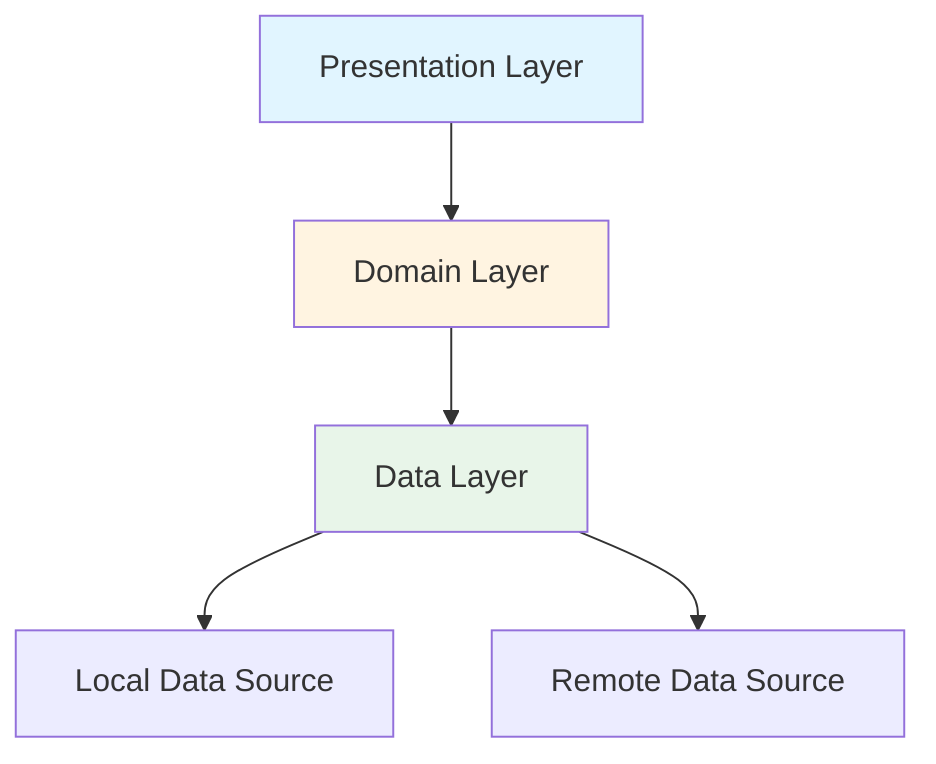
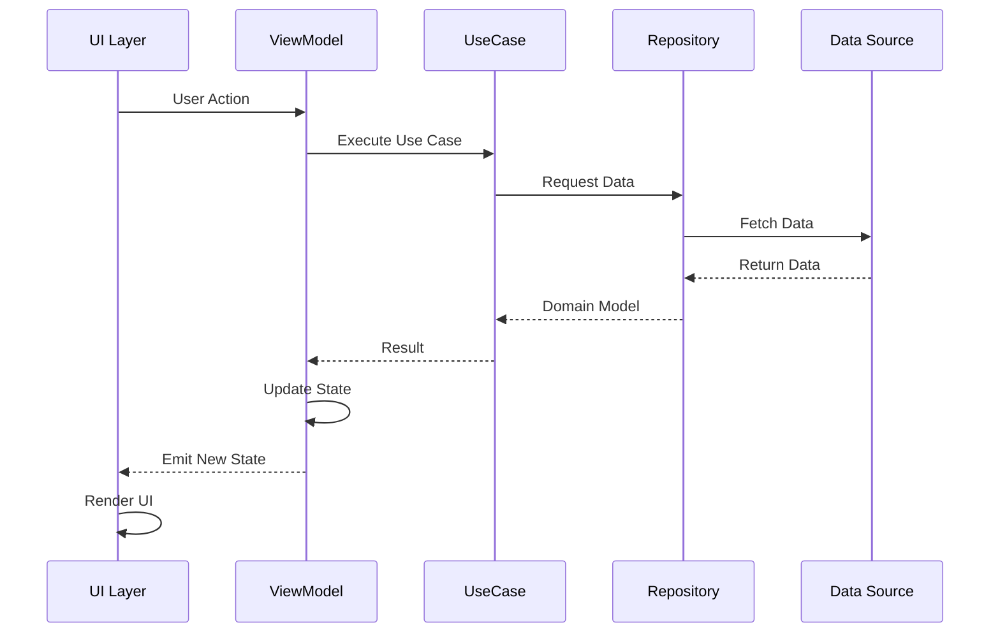

# AI-Thaker — Kotlin Clean Architecture Guide

> **Project Name:** AI-Thaker  
> **Architecture:** Clean Architecture + MVVM  
> **Language:** Kotlin  
> **UI Framework:** Jetpack Compose

This document presents a simplified, clean, and best-practice approach for building the AI-Thaker Android application using Clean Architecture with MVVM pattern.

---

## 📋 Table of Contents

1. [Core Principles](#1-core-principles)
2. [Architecture Overview](#2-architecture-overview)
3. [Project Structure](#3-project-structure)
4. [Dependency Injection](#4-dependency-injection)
5. [Data Flow](#5-data-flow)
6. [Error Handling](#6-error-handling)
7. [State Management](#7-state-management)
8. [Testing Strategy](#8-testing-strategy)
9. [Feature Development Steps](#9-feature-development-steps)
10. [Code Quality Guidelines](#10-code-quality-guidelines)
11. [Best Practices](#11-best-practices)

---

## 1. Core Principles

### **Keep It Simple**

- Architecture should be simple and maintainable
- Avoid over-engineering
- Each layer has a clear, single responsibility

### **Separation of Concerns**

- **UI Layer**: Only handles presentation and user interaction
- **Domain Layer**: Contains business logic (pure Kotlin, no Android dependencies)
- **Data Layer**: Manages data sources and data operations

### **Dependency Rule**

```
UI Layer → Domain Layer → Data Layer
(Inner layers know nothing about outer layers)
```

### **Testability First**

- Business logic is testable without Android framework
- Use dependency injection for easier testing
- Write tests as you develop features

---

## 2. Architecture Overview

### **Three-Layer Architecture**



### **Presentation Layer (UI + ViewModel)**

**Technology:** Jetpack Compose + ViewModel

**Responsibilities:**

- Display UI based on state
- Handle user interactions
- Observe ViewModel state changes
- Navigate between screens

**Key Components:**

- **Composable Functions**: UI screens and components
- **ViewModel**: Manages UI state and business logic coordination
- **UI State Classes**: Data classes representing UI state

**Example:**

```kotlin
@Composable
fun AthkarScreen(
    viewModel: AthkarViewModel = hiltViewModel()
) {
    val state by viewModel.state.collectAsState()

    when {
        state.isLoading -> LoadingView()
        state.error != null -> ErrorView(state.error)
        else -> AthkarList(state.athkarList)
    }
}
```

### **Domain Layer**

**Pure Kotlin** (no Android dependencies)

**Contains:**

1. **Use Cases** - Single responsibility business logic operations
2. **Repository Interfaces** - Contracts for data operations
3. **Domain Models** - Business entities
4. **Business Logic** - Core application rules

**Example:**

```kotlin
// Use Case
class GetDailyAthkarUseCase(
    private val repository: AthkarRepository
) {
    suspend operator fun invoke(): Result<List<Athkar>> {
        return repository.getDailyAthkar()
    }
}

// Repository Interface
interface AthkarRepository {
    suspend fun getDailyAthkar(): Result<List<Athkar>>
    suspend fun searchAthkar(query: String): Result<List<Athkar>>
}

// Domain Model
data class Athkar(
    val id: String,
    val title: String,
    val arabicText: String,
    val transliteration: String,
    val translation: String,
    val category: AthkarCategory,
    val repeat: Int
)
```

### **Data Layer**

**Responsibilities:**

- Implement repository interfaces
- Manage data sources (local/remote)
- Cache management
- Data mapping (DTO ↔ Domain Model)

**Components:**

- **Repository Implementation**
- **Data Sources** (Remote API, Local Database)
- **DTOs** (Data Transfer Objects)
- **Mappers** (Convert between DTO and Domain Model)

**Example:**

```kotlin
class AthkarRepositoryImpl(
    private val localDataSource: AthkarLocalDataSource,
    private val remoteDataSource: AthkarRemoteDataSource
) : AthkarRepository {
    override suspend fun getDailyAthkar(): Result<List<Athkar>> {
        return try {
            // Try local cache first
            val cachedData = localDataSource.getDailyAthkar()
            if (cachedData.isNotEmpty()) {
                Result.success(cachedData.map { it.toDomain() })
            } else {
                // Fetch from remote
                val remoteData = remoteDataSource.fetchDailyAthkar()
                localDataSource.saveAthkar(remoteData)
                Result.success(remoteData.map { it.toDomain() })
            }
        } catch (e: Exception) {
            Result.failure(e)
        }
    }
}
```

---

## 3. Project Structure

### **Recommended Folder Structure**

```
app/
├── src/
│   ├── main/
│   │   ├── java/com/example/aithaker/
│   │   │   ├── ui/
│   │   │   │   ├── screens/
│   │   │   │   │   ├── home/
│   │   │   │   │   │   ├── HomeScreen.kt
│   │   │   │   │   │   ├── HomeViewModel.kt
│   │   │   │   │   │   └── HomeState.kt
│   │   │   │   │   ├── athkar/
│   │   │   │   │   └── settings/
│   │   │   │   ├── components/
│   │   │   │   ├── navigation/
│   │   │   │   └── theme/
│   │   │   ├── domain/
│   │   │   │   ├── model/
│   │   │   │   │   ├── Athkar.kt
│   │   │   │   │   └── AthkarCategory.kt
│   │   │   │   ├── repository/
│   │   │   │   │   └── AthkarRepository.kt
│   │   │   │   └── usecase/
│   │   │   │       ├── GetDailyAthkarUseCase.kt
│   │   │   │       └── SearchAthkarUseCase.kt
│   │   │   ├── data/
│   │   │   │   ├── repository/
│   │   │   │   │   └── AthkarRepositoryImpl.kt
│   │   │   │   ├── local/
│   │   │   │   │   ├── database/
│   │   │   │   │   ├── dao/
│   │   │   │   │   └── entity/
│   │   │   │   ├── remote/
│   │   │   │   │   ├── api/
│   │   │   │   │   └── dto/
│   │   │   │   └── mapper/
│   │   │   │       └── AthkarMapper.kt
│   │   │   ├── di/
│   │   │   │   ├── AppModule.kt
│   │   │   │   ├── DatabaseModule.kt
│   │   │   │   ├── NetworkModule.kt
│   │   │   │   └── RepositoryModule.kt
│   │   │   ├── common/
│   │   │   │   ├── utils/
│   │   │   │   ├── constants/
│   │   │   │   └── extensions/
│   │   │   └── MainActivity.kt
│   │   └── AndroidManifest.xml
│   └── test/
└── build.gradle.kts
```

### **Layer-by-Layer Breakdown**

#### **UI Layer** (`ui/`)

- `screens/`: Feature-based screen organization
- `components/`: Reusable composable components
- `navigation/`: Navigation setup and routes
- `theme/`: Theme, colors, typography

#### **Domain Layer** (`domain/`)

- `model/`: Domain entities (business objects)
- `repository/`: Repository interfaces
- `usecase/`: Business logic use cases

#### **Data Layer** (`data/`)

- `repository/`: Repository implementations
- `local/`: Room database, DataStore
- `remote/`: Retrofit API, DTOs
- `mapper/`: Data transformation logic

#### **DI Layer** (`di/`)

- Hilt modules for dependency injection
- Organized by concern (Database, Network, Repository, etc.)

#### **Common** (`common/`)

- Utilities, extensions, constants
- Shared across all layers

---

## 4. Dependency Injection

### **Recommended: Hilt (Dagger Hilt)**

**Why Hilt?**

- ✅ Official Android DI solution
- ✅ Compile-time safety
- ✅ Built specifically for Android
- ✅ Great integration with ViewModel

**Alternative: Koin** (simpler, runtime DI)

### **Hilt Setup**

**1. Add Dependencies** (`app/build.gradle.kts`):

```kotlin
plugins {
    id("com.google.dagger.hilt.android")
    id("com.google.devtools.ksp")
}

dependencies {
    implementation("com.google.dagger:hilt-android:2.48")
    ksp("com.google.dagger:hilt-compiler:2.48")
    implementation("androidx.hilt:hilt-navigation-compose:1.1.0")
}
```

**2. Application Class**:

```kotlin
@HiltAndroidApp
class AiThakerApplication : Application()
```

**3. Module Examples**:

```kotlin
// DatabaseModule.kt
@Module
@InstallIn(SingletonComponent::class)
object DatabaseModule {

    @Provides
    @Singleton
    fun provideDatabase(@ApplicationContext context: Context): AthkarDatabase {
        return Room.databaseBuilder(
            context,
            AthkarDatabase::class.java,
            "aithaker_db"
        ).build()
    }

    @Provides
    fun provideAthkarDao(database: AthkarDatabase): AthkarDao {
        return database.athkarDao()
    }
}

// RepositoryModule.kt
@Module
@InstallIn(SingletonComponent::class)
abstract class RepositoryModule {

    @Binds
    @Singleton
    abstract fun bindAthkarRepository(
        impl: AthkarRepositoryImpl
    ): AthkarRepository
}
```

---

## 5. Data Flow

### **Unidirectional Data Flow**



### **Flow Example**

```kotlin
// 1. User clicks button in UI
@Composable
fun AthkarScreen(viewModel: AthkarViewModel = hiltViewModel()) {
    Button(onClick = { viewModel.loadAthkar() }) {
        Text("Load Athkar")
    }
}

// 2. ViewModel receives action
class AthkarViewModel @Inject constructor(
    private val getDailyAthkarUseCase: GetDailyAthkarUseCase
) : ViewModel() {

    private val _state = MutableStateFlow(AthkarState())
    val state: StateFlow<AthkarState> = _state.asStateFlow()

    fun loadAthkar() {
        viewModelScope.launch {
            _state.update { it.copy(isLoading = true) }

            getDailyAthkarUseCase()
                .onSuccess { athkarList ->
                    _state.update {
                        it.copy(
                            isLoading = false,
                            athkarList = athkarList
                        )
                    }
                }
                .onFailure { error ->
                    _state.update {
                        it.copy(
                            isLoading = false,
                            error = error.toAppError()
                        )
                    }
                }
        }
    }
}

// 3. UseCase executes business logic
class GetDailyAthkarUseCase @Inject constructor(
    private val repository: AthkarRepository
) {
    suspend operator fun invoke(): Result<List<Athkar>> {
        return repository.getDailyAthkar()
            .map { list -> list.filter { it.isDaily } }
    }
}

// 4. Repository fetches data
class AthkarRepositoryImpl @Inject constructor(
    private val localDataSource: AthkarLocalDataSource
) : AthkarRepository {
    override suspend fun getDailyAthkar(): Result<List<Athkar>> {
        return try {
            val data = localDataSource.getDailyAthkar()
            Result.success(data.map { it.toDomain() })
        } catch (e: Exception) {
            Result.failure(e)
        }
    }
}
```

---

## 6. Error Handling

### **Unified Error Model**

```kotlin
sealed class AppError {
    data class NetworkError(val message: String) : AppError()
    data class DatabaseError(val message: String) : AppError()
    data class ValidationError(val field: String, val message: String) : AppError()
    data object NotFound : AppError()
    data object Unauthorized : AppError()
    data class Unknown(val exception: Throwable) : AppError()
}

// Extension function to convert exceptions to AppError
fun Throwable.toAppError(): AppError = when (this) {
    is IOException -> AppError.NetworkError(message ?: "Network error")
    is HttpException -> when (code()) {
        404 -> AppError.NotFound
        401 -> AppError.Unauthorized
        else -> AppError.NetworkError("HTTP ${code()}: $message")
    }
    is SQLException -> AppError.DatabaseError(message ?: "Database error")
    else -> AppError.Unknown(this)
}

// UI-friendly error messages
fun AppError.toUserMessage(): String = when (this) {
    is AppError.NetworkError -> "Network error: $message"
    is AppError.DatabaseError -> "Storage error occurred"
    is AppError.ValidationError -> "$field: $message"
    is AppError.NotFound -> "Content not found"
    is AppError.Unauthorized -> "Please log in to continue"
    is AppError.Unknown -> "An unexpected error occurred"
}
```

---

## 7. State Management

### **UI State Pattern**

```kotlin
data class AthkarState(
    val isLoading: Boolean = false,
    val athkarList: List<Athkar> = emptyList(),
    val selectedCategory: AthkarCategory? = null,
    val searchQuery: String = "",
    val error: AppError? = null
)

// ViewModel
class AthkarViewModel @Inject constructor(
    private val getDailyAthkarUseCase: GetDailyAthkarUseCase,
    private val searchAthkarUseCase: SearchAthkarUseCase
) : ViewModel() {

    private val _state = MutableStateFlow(AthkarState())
    val state: StateFlow<AthkarState> = _state.asStateFlow()

    // State updates are centralized
    private fun updateState(update: (AthkarState) -> AthkarState) {
        _state.update(update)
    }

    fun onSearchQueryChanged(query: String) {
        updateState { it.copy(searchQuery = query) }
        searchAthkar(query)
    }

    private fun searchAthkar(query: String) {
        viewModelScope.launch {
            updateState { it.copy(isLoading = true, error = null) }

            searchAthkarUseCase(query)
                .onSuccess { results ->
                    updateState {
                        it.copy(
                            isLoading = false,
                            athkarList = results
                        )
                    }
                }
                .onFailure { error ->
                    updateState {
                        it.copy(
                            isLoading = false,
                            error = error.toAppError()
                        )
                    }
                }
        }
    }
}
```

---

## 8. Testing Strategy

### **Testing Pyramid**

```
     /\
    /  \    E2E Tests (Few)
   /____\
  /      \  Integration Tests (Some)
 /________\
/__________\ Unit Tests (Many)
```

### **1. Unit Tests** (Domain Layer)

**Test:** Use cases with pure business logic

```kotlin
class GetDailyAthkarUseCaseTest {

    private lateinit var useCase: GetDailyAthkarUseCase
    private lateinit var repository: FakeAthkarRepository

    @Before
    fun setup() {
        repository = FakeAthkarRepository()
        useCase = GetDailyAthkarUseCase(repository)
    }

    @Test
    fun `when repository returns data, use case returns daily athkar only`() = runTest {
        // Given
        val allAthkar = listOf(
            createAthkar(isDaily = true),
            createAthkar(isDaily = false),
            createAthkar(isDaily = true)
        )
        repository.setAthkarList(allAthkar)

        // When
        val result = useCase()

        // Then
        assertTrue(result.isSuccess)
        assertEquals(2, result.getOrNull()?.size)
        assertTrue(result.getOrNull()?.all { it.isDaily } == true)
    }
}
```

### **2. Integration Tests** (Repository)

```kotlin
class AthkarRepositoryImplTest {

    private lateinit var repository: AthkarRepositoryImpl
    private lateinit var localDataSource: FakeLocalDataSource
    private lateinit var remoteDataSource: FakeRemoteDataSource

    @Test
    fun `when cache is empty, fetch from remote and cache locally`() = runTest {
        // Given
        localDataSource.setEmpty()
        val remoteData = listOf(createAthkarDto())
        remoteDataSource.setData(remoteData)

        // When
        val result = repository.getDailyAthkar()

        // Then
        assertTrue(result.isSuccess)
        assertTrue(localDataSource.wasSaveCalled())
        assertEquals(1, localDataSource.getCachedCount())
    }
}
```

### **3. UI Tests** (ViewModels)

```kotlin
class AthkarViewModelTest {

    @get:Rule
    val mainDispatcherRule = MainDispatcherRule()

    private lateinit var viewModel: AthkarViewModel
    private lateinit var getDailyAthkarUseCase: FakeGetDailyAthkarUseCase

    @Test
    fun `when loadAthkar is called, state updates correctly`() = runTest {
        // Given
        val athkarList = listOf(createAthkar())
        getDailyAthkarUseCase.setResult(Result.success(athkarList))

        // When
        viewModel.loadAthkar()
        advanceUntilIdle()

        // Then
        val state = viewModel.state.value
        assertFalse(state.isLoading)
        assertEquals(athkarList, state.athkarList)
        assertNull(state.error)
    }
}
```

---

## 9. Feature Development Steps

### **Phase 1: Foundation Setup** (Week 1)

#### **Step 1.1: Create Project Structure**

- [ ] Create package structure (`ui/`, `domain/`, `data/`, `di/`, `common/`)
- [ ] Set up Git and `.gitignore`
- [ ] Create README.md with project overview

#### **Step 1.2: Configure Dependencies**

- [ ] Add Hilt dependencies
- [ ] Add Room dependencies
- [ ] Add Retrofit dependencies (if needed)
- [ ] Add Compose BOM
- [ ] Add testing dependencies

#### **Step 1.3: Initialize DI**

- [ ] Create `@HiltAndroidApp` application class
- [ ] Update `AndroidManifest.xml`
- [ ] Create basic modules (AppModule, DatabaseModule)

#### **Step 1.4: Build Core Classes**

- [ ] Create `AppError` sealed class
- [ ] Create base `Result` wrapper (or use Kotlin's Result)
- [ ] Create common extensions
- [ ] Set up logging utility

---

### **Phase 2: Data Layer** (Week 1-2)

#### **Step 2.1: Define Domain Models**

- [ ] Create `Athkar.kt` domain model
- [ ] Create `AthkarCategory.kt` enum/sealed class
- [ ] Create repository interfaces

#### **Step 2.2: Set Up Local Data Source**

- [ ] Create Room database
- [ ] Create DAO interfaces
- [ ] Create entity classes
- [ ] Write database migrations

#### **Step 2.3: Implement Repository**

- [ ] Create repository implementation
- [ ] Add caching logic
- [ ] Create mappers (Entity → Domain Model)
- [ ] Write repository tests

---

### **Phase 3: First Feature** (Week 2-3)

#### **Step 3.1: Create Use Case**

- [ ] Implement `GetDailyAthkarUseCase`
- [ ] Write unit tests for use case

#### **Step 3.2: Build ViewModel**

- [ ] Create `AthkarViewModel`
- [ ] Define `AthkarState` data class
- [ ] Implement state management
- [ ] Write ViewModel tests

#### **Step 3.3: Create UI**

- [ ] Design Athkar list screen
- [ ] Create reusable components
- [ ] Implement navigation
- [ ] Add loading and error states

---

### **Phase 4: Testing & Stability** (Week 3-4)

- [ ] Write unit tests for all use cases
- [ ] Write integration tests for repositories
- [ ] Write UI tests for ViewModels
- [ ] Add instrumentation tests for critical flows
- [ ] Implement error handling throughout
- [ ] Add proper loading states
- [ ] Test edge cases

---

### **Phase 5: Feature Expansion** (Ongoing)

For each new feature:

1. **Domain First**

   - Define domain model
   - Create use case
   - Write tests

2. **Data Layer**

   - Add database entities/DAOs
   - Update repository
   - Create mappers

3. **UI Layer**

   - Create ViewModel
   - Build screens
   - Add navigation

4. **Test & Polish**
   - Write tests
   - Handle edge cases
   - Improve UX

---

## 10. Code Quality Guidelines

### **Naming Conventions**

```kotlin
// Classes - PascalCase
class AthkarRepository
data class Athkar

// Functions - camelCase
fun loadDailyAthkar()
fun searchByCategory()

// Constants - SCREAMING_SNAKE_CASE
const val MAX_RETRY_COUNT = 3
const val DATABASE_NAME = "aithaker_db"

// Private properties - _camelCase (for backing properties)
private val _state = MutableStateFlow()
val state = _state.asStateFlow()
```

### **File Organization**

1. **One class per file** (unless tightly coupled)
2. **File name matches class name**
3. **Group related files in packages**
4. **Keep files under 300 lines**

### **Code Style**

```kotlin
// ✅ Good - Clear, concise, readable
class GetDailyAthkarUseCase @Inject constructor(
    private val repository: AthkarRepository
) {
    suspend operator fun invoke(): Result<List<Athkar>> {
        return repository.getDailyAthkar()
    }
}

// ❌ Bad - Overly complex
class GetDailyAthkarUseCase @Inject constructor(
    private val repository: AthkarRepository,
    private val validator: Validator,
    private val logger: Logger,
    private val analytics: Analytics
) {
    suspend operator fun invoke(
        forceRefresh: Boolean = false,
        includeArchived: Boolean = false
    ): Result<List<Athkar>> {
        logger.log("Getting daily athkar")
        // ... complex logic
    }
}
```

---

## 11. Best Practices

### **✅ DO**

1. **Keep ViewModels thin** - Delegate to use cases
2. **Make use cases single-purpose** - One responsibility
3. **Write tests first** for complex logic
4. **Use meaningful variable names** - `athkarList` not `list`
5. **Handle errors gracefully** - Never ignore exceptions
6. **Use coroutines** for async operations
7. **Leverage Kotlin features** - Data classes, sealed classes, extensions
8. **Document complex logic** - Add comments for "why", not "what"
9. **Keep domain layer pure** - No Android dependencies
10. **Use StateFlow** for state management in ViewModels

### **❌ DON'T**

1. **Don't put business logic in UI** - Belongs in use cases
2. **Don't use LiveData** - Prefer StateFlow/Flow
3. **Don't ignore errors** - Always handle them
4. **Don't over-abstract** - Keep it simple
5. **Don't skip tests** - They save time in the long run
6. **Don't hardcode strings** - Use string resources
7. **Don't use magic numbers** - Use named constants
8. **Don't mix concerns** - Each layer has one job
9. **Don't use global state** - Inject dependencies
10. **Don't make everything public** - Use appropriate visibility

---

## 📚 Additional Resources

### **Official Documentation**

- [Kotlin Documentation](https://kotlinlang.org/docs/home.html)
- [Jetpack Compose](https://developer.android.com/jetpack/compose)
- [Hilt Documentation](https://dagger.dev/hilt/)
- [Android Architecture Guide](https://developer.android.com/topic/architecture)

### **Recommended Libraries**

- **UI:** Jetpack Compose, Material 3
- **DI:** Hilt
- **Database:** Room
- **Networking:** Retrofit, OkHttp
- **Serialization:** Kotlinx Serialization
- **Testing:** JUnit, Mockk, Turbine, Compose UI Test

---

## 🎯 Project Philosophy

> **Simplicity** over complexity  
> **Readability** over cleverness  
> **Testability** over quick fixes  
> **Consistency** over individual preferences

Build features iteratively, test continuously, and maintain clean code throughout the development lifecycle.

---

**Document Version:** 2.0  
**Last Updated:** 2025-11-22  
**Maintained by:** AI-Thaker Development Team
